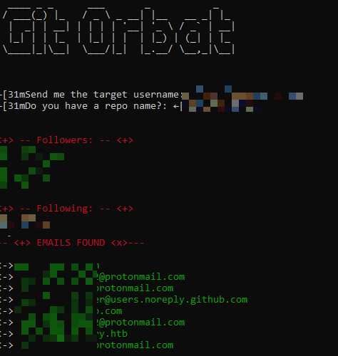

### OSINT Tool for email and information extraction of Github using the Official API.

## Installation ⌨️ 
Python3 libs to install:
- colorama
- requests
- pyfiglet
- re

`pip3 install <package_name>`

## How to use ❓
- python3 git-orbat.py
- Then you will be asked for the target username and a repo name of the target (optional parameter)

## What information extracts?
✔️ Implemented:
✅ Email
✅ Followers
✅ Following

⬇️ 30.07.2021 ⬇️

✅ Avatar Photo
✅ User ID
✅ Profile Creation date
✅ Account Type
✅ Public Gists
✅ Location (If provided)
✅ Repo name & Creation date 
✅ Deleted repo name & Creation Date
✅ Extract Bio text
✅ Company
✅ Last user update

❌ To Implement: 
- Enrichment of email using other sources of information
- PDF Report

## Example 

## Author
Twitter: SrJokes
Contact: SrJokes@protonmail.com
